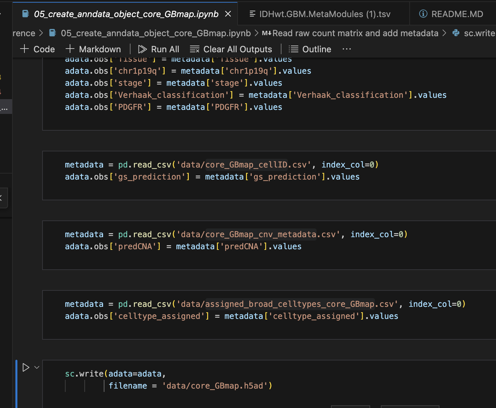
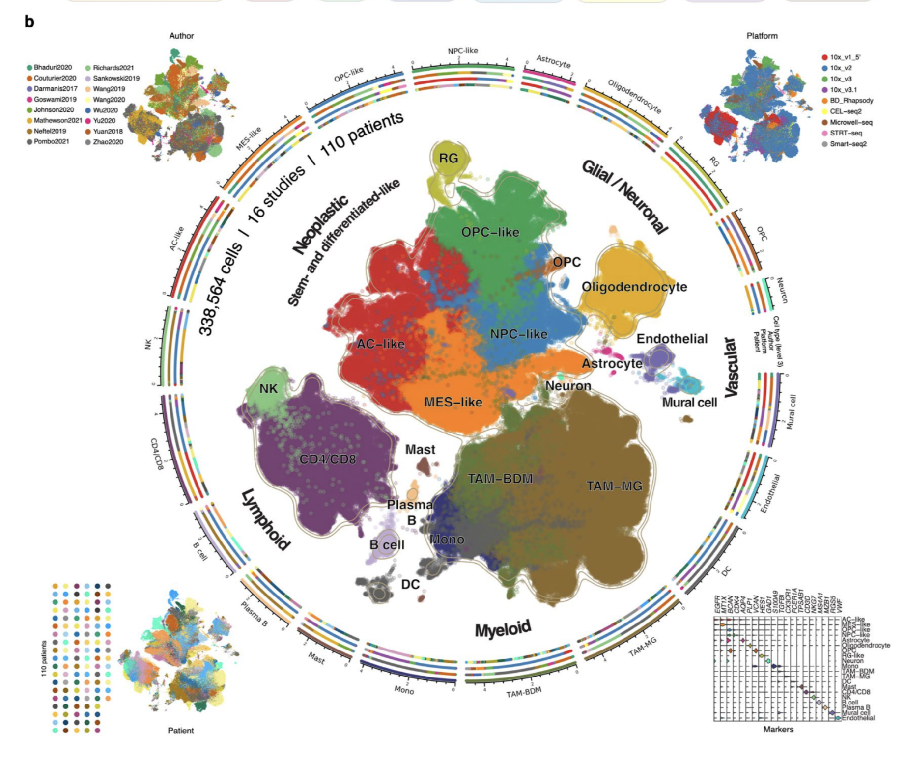
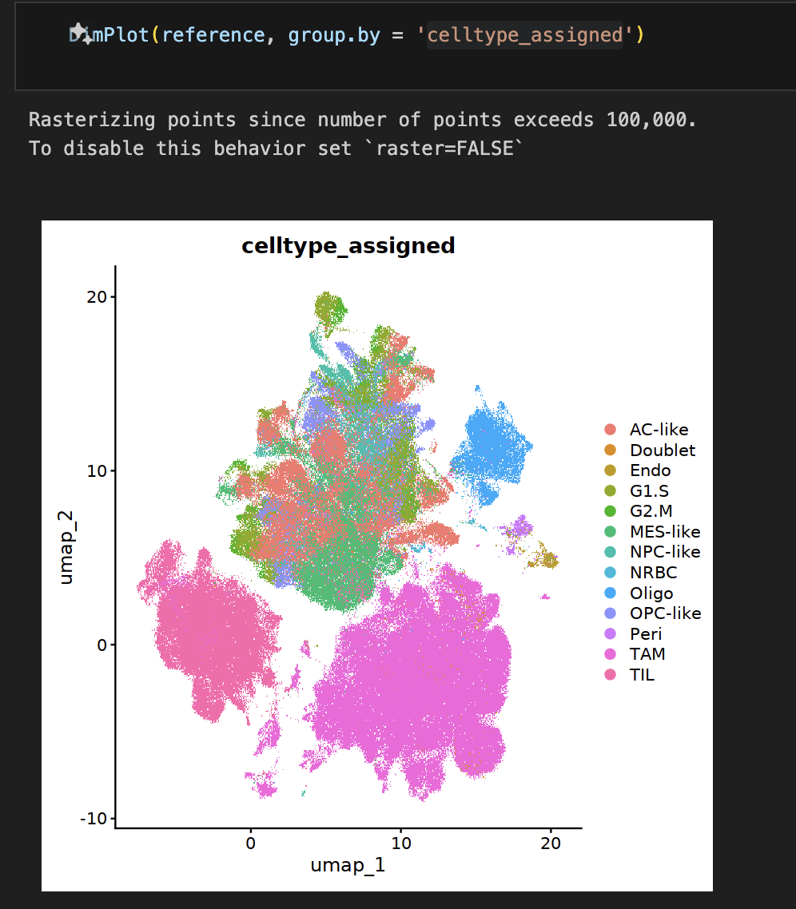
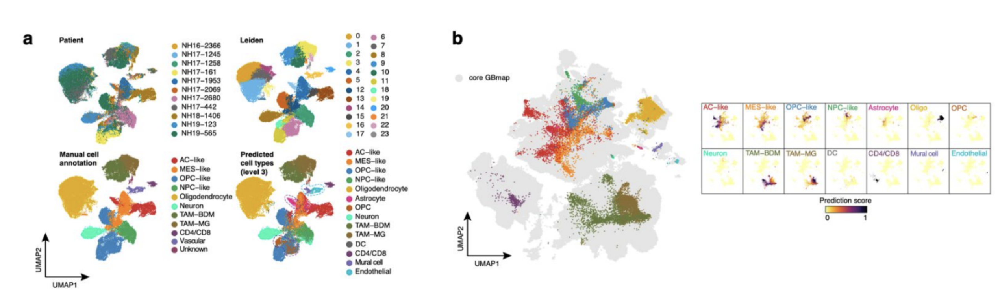

# zapiski 

# suplementary 


## S2

    
    As a first step, we performed an independent
    automated cell annotation using a cataloged list of markers (Table S2), unsupervised manual
    assignment, and curation of broad cell types (Clarke et al., 2021).


notebook ```02_automated_cell_annotation_with_cellID.ipynb``` ( automated cell annotation using a cataloged list of markers (Table S2))


Using CellID Library and a list of markers from Table S2 the authors annotated the cells. 


RESULT IS 


Next in notebook ```03_cell_annotation_per_study.ipynb```

    markers <- c('PTPRZ1', 'CD44', 'CD24', # malignant cells
             'MBP', 'MOBP', 'PLP1',# oligodendrocytes
             'GFAP', 'AQP4', # astrocytes
             'SYT1', # neurons
             'PTPRC', #immune cells
             'ITGA4', 'CD14', 'TGFBI','CD163', # BDM-like
             'P2RY12', 'CX3CR1', # MG-like
             'CD96', 'CD8A', 'IL7R', # T cells
             'VWF','FLT1', # endothelial 
             'DLC1', 'PDGFRB', 'PRKG1' # pericytes
            )
    signatures <- as.data.frame(data.table::fread('data/IDHwt.GBM.MetaModules.tsv'))

    Generating homogeneous annotation of cell clusters per study (broad cell identity) to integrate data with SCANVI
    Considering CellID prediction, classical markers, enrichment scores of cancer cell states and original cell annotation when available.


signatures from study https://www.ncbi.nlm.nih.gov/pubmed/31327527 are used for enrichment scores of cancer cell states. 
Each signature represents a specific biological module or program, such as a metabolic pathway, a cell-cycle phase...
We can use those signatures 

Enrichment Scores of Cancer Cell States means Utilizing the gene signatures to calculate enrichment scores for each cell, indicating the presence and intensity of specific cancer-related biological programs or states.

The authors generated a homogunus anotation of cell clusters per study (broad cell identity) to integrate data with SCANVI. They considered CellID prediction, classical markers, enrichment scores of cancer cell states and original cell annotation when available.

 they used AddModuleScore_UCell and AddModuleScore functions to calculate enrichment scores of cancer cell states.
The AddModuleScore_UCell and AddModuleScore functions were used to calculate how much certain groups of genes, associated with specific cancer cell states, were active in each cell. Essentially, these scores help to understand which cancer traits are more pronounced in each cell based on their gene activity.


next in notebook ```05_create_anndata_object_core_GBmap.ipynb```

The authors join these predictions fredictions in to one object
first are CellId predictions then predCNA (i think original cell annotation) and then celltype_assigned from previous notebook.

they produce ```data/core_GBmap.h5ad' file```

Next 

scANVI https://www.embopress.org/doi/full/10.15252/msb.20209620
libray https://docs.scarches.org/en/latest/ https://docs.scarches.org/en/latest/scanvi_surgery_pipeline.html
    
    To overcome the technical challenge of data integration, we employed a semi-supervised
    neural network model (scANVI) (Xu et al., 2021) implemented in the transfer-learning
    framework of the scArches algorithm (Lotfollahi et al., 2021), which takes advantage of the
    uniform prior cell type labeling to harmonize the datasets while preserving cell biodiversity.
    After co-embedding all cells in a dimensionality reduction space, we reconstructed a detailed
    TME cell map broadly divided into neoplastic and non-neoplastic cells (neuronal/glial,
    myeloid, lymphoid, and vascular) (Fig. 1b).




Trening results of SCAnvi model
celltype_assigned is from notebook ```03_cell_annotation_per_study.ipynb```
predictions is from scanvi model trained on celltype_assigned


they used laiden algorithm on the latent representetion of the scanvi model to cluster the cells.

The Leiden algorithm is a method used for community detection in networks, which is particularly useful in the analysis of single-cell RNA sequencing (scRNA-seq) data for identifying cell clusters. 

Using the Leiden algorithm's results stored in the metadata, the script assigns cell identities based on cluster assignments (e.g., "TIL" for tumor-infiltrating lymphocytes, "TAM" for tumor-associated macrophages). It then visualizes these annotations on UMAP plots.

celltype_assigned is from notebook ```03_cell_annotation_per_study.ipynb```



    For cell annotation, we considered the results from the automatic cell annotation, the original cell label (when available), 
    the infered CNV information, the cell-type annotation available on the TISCH website (Sun et al., 2021) (when available),
    and the expression of cell type-specific marker genes identified using the Wilcoxon rank-sum test 
    by comparing all cells within a specific cluster to all cells outside said cluster. 


They then did subanalyisis on selected coarse cell types. 


They were interested  in these types


    Next, we identified gene modules (programs) to define representative phenotypes for each
    category in greater detail (Table S3). The gene modules detected in neoplastic cells were 5
    consistent with cellular states that mimic astrocyte (AC)-like, neural precursor cell (NPC)-like,
    oligodendrocyte percussor cell (OPC)-like, and mesenchymal (MES)-like states (Neftel et al.,
    2019) (Fig. 2a and S2a). Additional cellular (sub)programs within the cancer phenotypes
    included hypoxia and major histocompatibility complex class (MHC)-II/cytokine modules,
    particularly enriched in MES-like cells as described in published studies (Hara et al., 2021;
    Neftel et al., 2019) (Fig. S2b). Enhanced cell proliferation was primarily seen with the
    OPC/NPC- and AC-like cells (Fig. S2b).


For each they did subanalysis. 

for example Neoplastic cells in ```08a_gene_module_detection_hotspot_neoplastic_GBmap.ipynb```


they take only the malignant cells and do gene module detection.
A latent representation of the data is obtained from the trained SCVI model.
Neighborhood relationships among cells are computed using k-nearest neighbors (KNN) based on the latent space.
The Leiden algorithm is applied to cluster cells into communities or cell types, and UMAP is used for visualization


Hotspot Analysis:

A Hotspot object is created to perform hotspot analysis on the scRNA-seq data.
A neighborhood graph is constructed to capture the local relationships between cells.
Determining Informative Genes:

The code computes autocorrelations for genes to determine which genes are informative.
Genes with significant lineage autocorrelation (FDR < 0.05) are selected for further analysis.

Grouping Genes into Lineage-Based Modules:

Grouping Genes into Lineage-Based Modules" refers to the process of categorizing genes into sets or modules based on their expression patterns across different cell lineages or cell types.
Genes that exhibit significant lineage autocorrelation are grouped into modules.
Modules are created based on gene correlation patterns and are defined by core genes with specific expression patterns.

Genes: In scRNA-seq data, each gene's expression level is measured across individual cells. Genes can have varying levels of expression in different cells.

Lineage-Based: Lineages refer to different cell populations or types within a biological system. For example, in the context of cancer research, these lineages might represent different cell types such as tumor cells, immune cells, or stromal cells.

Modules: Modules are groups or clusters of genes that exhibit similar expression patterns. Genes within the same module tend to be co-expressed, meaning their expression levels rise and fall together across cells. Modules capture the idea that certain genes are functionally related or involved in similar biological processes.

authors compute these modules.


In S3 suplementary they have a list of genes for each module.


Modules were then anotated in ```09a_cell_state_annotation_neoplastic_core_GBmap.ipynb```

    ``` For cell annotation, we considered the results from the gene module detection perfomed using Hotspot 
    and the expression of cell type-specific marker genes identified using the Wilcoxon rank-sum test
    by comparing all cells within a specific cluster to all cells outside said cluster. ```


again they used laiden  


They did similar alanysis for other cell types. and

    In summary, we created GBmap, a robust core reference atlas that delineates cell types and
    states. We also provide a systematic annotation at different levels of granularity, from coarse
    to refined cell identity (Fig. 2c and Table S4). 


 ### Reference mapping and large-scale integration by transfer learning

    One of the main goals of building a detailed GBmap is to provide a resource for the community
    to project unannotated ‘query’ datasets onto a harmonized reference. 
    
    To test the ability of our
    GBmap to recognize each cell (sub)type accurately, we generated single-nuclei RNA-seq from
    11 GB cases (Fig. 3a, Table S5), obtaining 39,355 high-quality cells. We compared the manual
    annotation of our de novo dataset with the label transfer upon reference mapping (Fig. 3b and
    S3a,b). The GBmap not only allowed the unsupervised reiteration of the major cell types but
    also resolved the difference between non-neoplastic and neoplastic cell types in one step
    (presence/absence of iCNV) (Fig. S3c). This is particularly important when distinguishing
    between states that share common gene signatures (e.g., normal OPC vs. OPC-like malignant) 




    Projecting new datasets on a predetermined reference map, although practical for fast evaluation and
    interpretation, has the disadvantage of forcing the queried cells to the reference and hiding
    novel findings.


    The transfer-learning method developed in the scArches pipeline instead
    updates and extends a trained model overcoming the limitation of forced cell mapping.
    
    To exemplify the integration of newly generated single-cell datasets into the core GBmap, we
    ‘upgraded’ it with new datasets that became available after the construction of our trained
    model, including our own profiled GB tissues (Table S1) (Fig. 3d). The outcome generated a
    joint embedding resulting in the extended GBmap (>1.1 million cells) (Fig. 3e). Our model
    recapitulated the major cell groups when comparing the label transfer from the core reference
    (predicted cell type) to the newly mapped datasets (original annotation) enabling consensual
    annotation across studies (Fig. S3f).
    
    Of note, after large-scale integration, we detected a cluster
    with a high expression of neutrophil markers (e.g., FCGR3B, CXCR2, FPR2) (Fig. 3f).
    Importantly, tumor-associated neutrophils were absent in the core GBmap reference and could
    now be retrieved in the queried datasets. POMEMBNO 